# **近世スペイン複式簿記史料マークアップのためのガイドライン（暫定版）**
**ver 0.9**

Last updated on 5th September 2020

# 小風尚樹・伏見岳志・中村雄祐

## Table of Contents

### [Section 1: 日記帳](#section1)
1. [Introduction](#introduction)
2. [Basic Structure](#structure)
3. [Transactionography](#transactionography)
4. [DEPCHA - Digital Edition Publishing Cooperative for Historical Accounts](#depcha)
5. [Markup Examples](#markup-examples)
6. [RDF](#rdf)
7. [Visualization](#viz)

### [Section 2: 元帳](#section2)
1. [Markup Examples](#markup-example)
2. [Linking](#linking)
3. [XBRLの検討](#xbrl)

- [Reference Lists](#reference-lists)

---
# <a id="section1">Section 1</a>

1. # <a id="introduction">Introduction</a>

本ガイドラインは、スペイン語複式簿記史料のTEIマークアップを目的としたものである。

まず複式簿記とは、すべての取引を発生した時間順に記した「日誌もしくは手帳Diario or Manual」と、そこに記載された取引を何らかの科目によって仕訳して転記した「元帳mayor」に大別される。この転記の際に、資金の出入りという観点だけでなく、それに対応した物品や権利の移動の観点からも取引内容を記すこと、つまりひとつの取引を2つの観点から転記することが、複式簿記の基本原理である。

**日記帳サンプル**

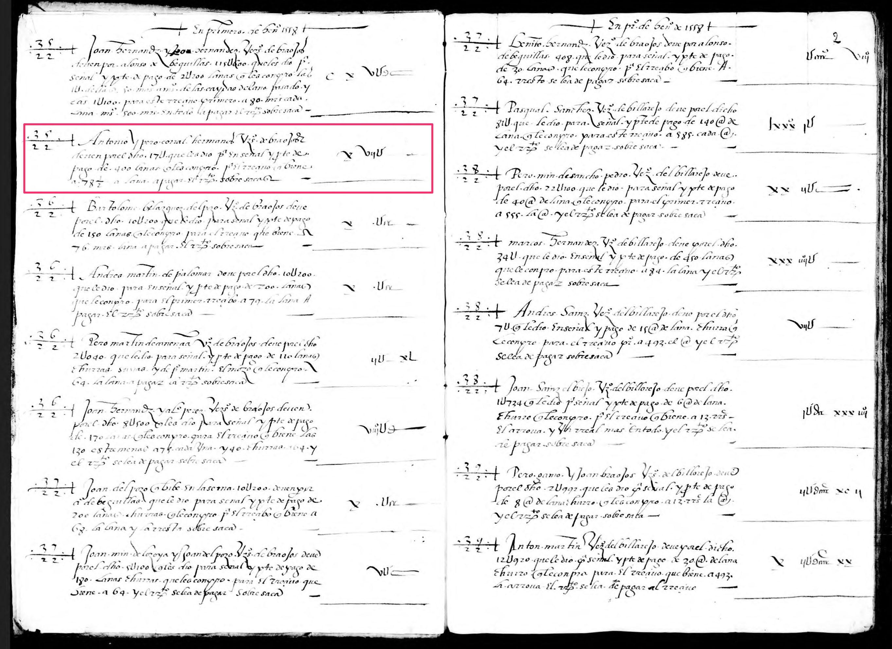
cf. Archivo de la Diputación Provincial de Burgos, Consulado del Mar, CM32

**元帳（借方）サンプル**

.jpg)

**元帳（貸方）サンプル**
.jpg)

cf. Archivo de la Diputación Provincial de Burgos, Consulado del Mar, CM108

したがって、複式簿記のTEIマークアップ、すなわち構造化されたテクストとしてコンピュータで処理しやすい形式のデータに変換するためには、日記帳と元帳の対応・参照関係を機械的に取り出せるようにすることが有用である。

本論では、複式簿記のマークアップの基本構造や最新のマークアップ理論を解説する。なお、ヘッダー内に記述する書誌情報や学術校訂版の編集情報については、本ガイドラインでは扱わないこととする。

---
2. # <a id="structure">Basic Structure</a>

## **2-1. 表形式**

複式簿記本体のマークアップは、[5章](#depcha)で説明するオントロジー表記の枠組みを作るだけで良い。現状、複式簿記本体のマークアップに際しては、\[[Tomasek 2016](#tomasek2016)\] や \[[GAMS 2017](#gams2017)\] で採用されているように、TEIの\<table\>エレメントを用いた体裁上のマークアップを枠組みとすることが主流であることから、本章では\<table\>エレメントを用いた基本構造について説明する（cf. TEI-C, eds., '**14.1.1 TEI Tables**'. *TEI P5*. Version 3.4.0. Last updated on 23rd July 2018, http://www.tei-c.org/release/doc/tei-p5-doc/ja/html/FT.html#FTTAB1 ）。

\<table\>エレメントは、端的に言えばエクセルシートのように行と列からなる表形式のテクストをマークアップする際に用いる。そのため、（実際に書かれているかどうかに関わらず）罫線で区切られた複式簿記の形式をマークアップするにも相性が良い。

イメージを具体化させるために、TEI P5ガイドラインから、\<table\>エレメントの使用例を引用する（ http://www.tei-c.org/release/doc/tei-p5-doc/ja/html/examples-table.html ）。

```xml
<div>
   <table rend="boxed" rows="2" cols="2">
      <head rend="it">Report of the conduct and progress of Ernest Pontifex. Upper Vth form
         — half term ending Midsummer 1851</head>
      <row>
         <cell role="label">Classics</cell>
         <cell>Idle listless and unimproving</cell>
      </row>
      <row>
         <cell role="label">Mathematics</cell>
         <cell>ditto</cell>
      </row>
      <row>
         <cell role="label">Divinity</cell>
         <cell>ditto</cell>
      </row>
      <row>
         <cell role="label">Conduct in house</cell>
         <cell>Orderly</cell>
      </row>
      <row>
         <cell role="label">General conduct</cell>
         <cell>Not satisfactory, on account of his great unpunctuality and inattention to
            duties</cell>
      </row>
   </table>
</div>
```

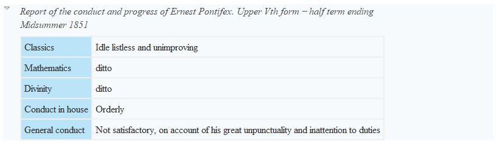

上記の例は、2×2の表をマークアップしたものである。TEIでは、なんらかのまとまりを表す\<div\>エレメントの子要素として\<table\>エレメントが用いられることが多いようだ。

\<table\>エレメントの子孫要素に注目してみると、\<head\>、\<row\>、そして\<cell\>エレメントがあることに気が付く。これらは、「表の見出し」、「表の行」、「表のセル」に対応している。エクセルシートを思い浮かべてみれば、セルの中に様々なデータを格納することから、行がそれらのセルを横方向に格納し、そしてそれらの行が積み重なることによって表が形成されることが想起される。

このことから、\<table\>の子要素に\<row\>、そしてさらにその子要素として\<cell\>が位置づけられているのである。

## **2-2. ページの区切り**
本節では、ページの区切りについて考察する。複式簿記の記述の際に、ページの区切りがどれほどの意味を持つのかについて筆者は判断しかねるが、例えば単純に紙面が足りなくなった場合に、共通のまとまりを持つ取引記録がページをまたいで記述されることが予想されるように、ページの区切りは必ずしも意味の区切りと対応しているわけではない。

TEIの実践においても、このテクストの体裁における物理的な区切りとしてのページは、テクストの意味解釈に基づいてマークアップが行われるべきだとするDescriptive Markupの方針からして重要視されない \[[Renear 2004](#Renear2004)\]。つまり、むしろ重視されるのは意味上のまとまりであって物理的なまとまりではない。

TEIガイドラインは、この原則をタグセットで表現するために、空要素（マイルストーン・タグ）を用いる。つまり、エレメントの中身にテクストを持たず、物理的な区切りを指し示す目印としてだけ使われるタグがいくつか存在するのである（cf. TEI-C, eds. '**3.10.3 Milestone Elements**', *TEI P5*. Version 3.4.0. Last updated on 23rd July 2018, http://www.tei-c.org/release/doc/tei-p5-doc/ja/html/CO.html#CORS5 ）。

- \<milestone\> : 当該セクションが構造要素により表現できない場合に、テクストの各セクション間にある境界点を示す。
- \<lb\> : line beginning. ある版における印刷上の新しい行の始まりを示す。
- \<cb\> : column beginning. テクストの段と段の境界を示す。
- \<pb\> : page beginning. テクストのページ境界を示す。
- \<gb\> : gathering beginning. 紙の一帖などの区切りを示す。

いずれの空要素も、標準的な参照システム、つまり@n属性や@xml:id属性、@facs属性などを用いて、史料画像と電子化テクストの対応関係を表現することが多い。以下に、\<pb\>エレメントの使用例を示す（ http://www.tei-c.org/release/doc/tei-p5-doc/ja/html/examples-pb.html ）。

```xml
<body>
 <pb n="1" facs="page1.png"/>
<!-- page1.png contains an image of the page;
                        the text it contains is encoded here -->
 <p>
<!-- ... -->
 </p>
 <pb n="2" facs="page2.png"/>
<!-- similarly, for page 2 -->
 <p>
<!-- ... -->
 </p>
</body>
```
上記の例では、ページ数を@n属性（numberの略）の値で表現し、対応する史料画像のファイル名を@facs属性の値として格納している。なお、より細かく画像の中の特定の箇所を指し示したい時には、Oxygen XML EditorのImage Map Editorという機能を用いることにより実現することができる（ https://www.oxygenxml.com/doc/versions/20.0/ug-editorEclipse/topics/image-map-editor.html ）。

例として、筆者が2016年9月から関わっている国立歴史民俗博物館の「古代の百科全書『延喜式』の多分野協働研究」の一環で作成したTEIファイルの画像参照の記述を示す。なお、このファイルは永崎研宣氏がIIIF 2018カンファレンスで発表した内容の基になっている \[[Laiacona et al. 2018](#laiacona2018)\]。

```xml
<!-- teiHeader内の記述（途中省略あり） -->
 <facsimile>
      <surface>
         <graphic url="https://www.dl.ndl.go.jp/api/iiif/1442231/R0000085/full/full/0/default.jpg"/>
         <zone xml:id="zone_a1h_3ls_wdb" lry="3250" lrx="3290" uly="815" ulx="3150"/>
         <zone xml:id="zone_ts1_jls_wdb" lry="3260" lrx="3150" uly="825" ulx="3025"/>
      </surface>
</facsimile>
<!-- body内の記述（途中省略あり） -->
<div type="条" n="26.5" corresp="主税上">
      <p>
         <title corresp="出挙本稲" n="中_956"/>諸国出挙正税・公廨・雑稲
         <lb facs="#zone_hpf_kkx_vdb"/>
         <lb facs="#zone_a1h_3ls_wdb"/>山城国、正税・公廨各十五万束、国分寺料一万五千束、嘉祥寺料一千七百
         <lb facs="#zone_ts1_jls_wdb"/>卌六束四把、海
      </p>
</div>
```
上記の例では、\<zone\>エレメント内の@xml:id属性の値を本文中\<lb\>エレメントの@facs属性が参照することにより、画像とテクストの対応関係を示している。画像の切り出しについては、Image Map Editor上で手作業により行ったが、自動化の手立てがあるのであれば、作業の効率化が図れるだろう。

---
3. # <a id="transactionography">Transactionography</a>

一般に、人文学史料のデジタルアーカイブ構築については、歴史的につくられてきた様々な史料のメタデータおよびコンテンツのデータを持続的に管理し、研究者や関心ある市民の間でデータを共有して原史料へのアクセスを確保することの重要性が認知されていると思われる。

しかしながら、その中でも特に財務記録を含む史料（手形・領収書・会計帳簿・出納帳・貿易統計など）については、統計処理のために数値をうまく取り出せるようにする必要があるため、このような財務記録史料の原史料へのアクセス性とデータ共有性、そして計算可能性を確保することは非常に困難であった。

具体的に言い換えるならば、近代以前における財務記録史料は、必ずしも表形式で記述されているわけではなく、散文の中に財務記録が含まれていることもあるため、数値計算に特化した現代的な表計算プログラムやソフトウェアでは原史料へのアクセス性を十分に確保することが難しいということである。さらに、統計処理のために数値を抽出しようとしても、関連する史料の間で記述が食い違うケースが往々にして存在するため、プログラム上で一意に財務記録を特定することが難しい。このような事情から、機械処理できる形式でかつ原文へのアクセスが可能な財務記録史料のデジタルアーカイブはほとんど存在しなかった \[[Tomasek and Bauman, 2013](#tomasek2013)\]。

こうした課題を解決する手法として提案されたのが、TEIに準拠した方法論「トランザクショノグラフィ（Transactionography）」である \[[Tomasek and Bauman, 2013](#tomasek2013)\]。これは、散文形式だけでなく複式簿記のような複雑な構造を含む財務記録マークアップのための拡張TEIスキーマの開発を含む研究であり、その本質は財務取引を「モノの移動」として構造的に捉えることにあった。すなわち、人や組織など取引主体の間を、取引されるモノが移動するという最小単位の動きさえマークアップできるようになれば、財務取引の情報を蓄積することによって結果的に財務記録史料のマークアップが完成するという考え方である。

このトランザクショノグラフィの研究プロジェクトの運用に関しては、アメリカNEH（the National Endowment for the Humanities）とドイツDFG（the Deutsche Forschungsgemeinschaft）の研究助成を受けており、研究コミュニティMEDEA（Modeling semantically Enriched Digital Edition of Accounts）によるワークショップが数度開催されている。

ただし、現在の開発の拠点は後述するDEPCHAを主導するグラーツ大学に移ってきており、本プロジェクトにおけるマークアップの方針についてはそちらを参照することとしたい。

---
4. # <a id="depcha">DEPCHA - Digital Edition Publishing Cooperative for Historical Accounts</a>

## **4-1. 複式簿記のセマンティックWeb表現のために**

\[[Vogeler, 2017](#vogeler2017)\]は、財務記録史料をマークアップするにあたっては、Semantic Webの概念を導入することを提唱している。オントロジー（テクストに記述されていることと現実世界の事象との関係性）の記述には、RDF/OWLが有力な選択肢だが、人文学史資料（特に美術館・博物館などの文化遺産セクター）の記述においては、CIDOC-CRMが最もよく使われるモデルである\[[Ciula & Eide, 2014](#ciula2014)\]。TEIとCIDOC-CRMについては\[[Eide, 2014](#eide2014)\]を参照のこと。

Georg VogelerとØyvind Eideは、MEDEAが開発したオントロジーと、CIDOC-CRMにある程度の親和性があるとの結論に至っている。MEDEAオントロジーについては、[GitHubページ](https://github.com/GVogeler/bookkeeping)を参照のこと。

Vogeler氏がプロジェクト・マネージャーを務めるGraz大学のDEPCHAは、このオントロジー表現についてのガイドラインを提供している。マークアップ方法について詳しくは次節で後述するが、その方法にしたがってマークアップした複式簿記のTEIファイルに、彼らの開発したXSLスタイルシート（ http://gams.uni-graz.at/depcha/depcha-TORDF.xsl ただし、2018年12月2日現在、アクセスできなくなっている。筆者の手元にはすでにデータとして保存済み）を適用すると、マークアップしたTEIファイルから、オントロジーを表現したRDF/XMLファイルを生成してくれる。このRDFファイルがあれば、例えば神崎正英氏によるRDF視覚化ツール（ https://www.kanzaki.com/works/2009/pub/graph-draw ）などを用いてリソース同士の関係性をグラフ化することもできる。DEPCHA自体もRDF可視化をサポートしているようだが、管見の限り該当ページは見当たらない。

DEPCHAオントロジーは、[4章](#transactionography) で説明したTransactionographyのモデルに基づきながらも、より人文学史資料のセマンティクスを表現するためにCIDOC-CRMとの親和性を高めることを目的としている。コンセプト自体は複雑に思えるが、実際のマークアップ方法はシンプルである。[3章](#structure) で説明した複式簿記本体のマークアップをベースとしながら、複式簿記を解釈する際に必要なエレメントに@ana属性と対応する参照IDを属性値として付与するだけで良い。

例えば、複式簿記のあるセルが日付を表しているとした場合は、次のようにマークアップする。
```xml
<cell>
      <date ana="bk:when" when="1808-08-08">8</date></cell>
<cell>
```
ここで重要なのは、\<date\>エレメント内の@ana属性と、その値であるbk:whenである。属性値として何を設定すれば良いかについては次節で説明するが、このように史料の解釈を@ana属性の値として付与していけばよい。

## **4-2. DEPCHAオントロジーの要件**

属性値を付与していけば良いと言っても、定められた構造にしたがう必要がある。そこで、DEPCHAオントロジーが定義する要件を確認しておこう（ http://gams.uni-graz.at/archive/objects/o:depcha.bookkeeping/methods/sdef:Ontology/get ）。

上記ページの解説、そして参考TEIファイル (https://gams.uni-graz.at/o:depcha.stagville.1/TEI_SOURCE) や \[[Tomasek, 2016](#tomasek2016)\] の記述をもとに、最低限必要な構造と対応する属性値とともに書き出すと次のようになる。

```xml
<table>
      <head>表の見出し</head>
      <row ana="bk:entry bk:transfer">
            <cell ana="bk:when">日付</cell>
            <cell><measure ana="bk:commodity bk:from">購入した品目など</measure></cell>
            <cell><measure ana="bk:money bk:to">購入金額など</measure></cell>
      </row>
</table>
```


例えば上記のように属性値を付与することによって、DEPCHAオントロジーにおいて「ひとつの取引（トランザクション）」が成立していることを表現することができる。

すなわち、「ひとつの取引 <span style="color: tomato">**bk:transaction**</span>」を構成するのは、「ひとつ以上の「モノの移動（Transfer）」 <span style="color: tomato">**bk:transfer**</span>」であり、この「モノの移動」が成立するためには、「いつ <span style="color: tomato">**bk:when**</span>」「誰から <span style="color: tomato">**bk:from**</span>」「誰に <span style="color: tomato">**bk:to**</span>」「何が送られたか（※厳密には、何を所有する権利が譲渡されたか） <span style="color: tomato">**bk:commodity bk:service**</span>」「代償として何が支払われたか <span style="color: tomato">**bk:money**</span>」といった情報が記述されることが必要なのである。

その際、DEPCHAでは、トランザクションに関わった人物やグループそれぞれに、固有の参照IDが付されることを要求している。これは、DEPCHAがTEIマークアップファイルから取引に関する情報だけを取り出してRDFグラフを用いた表現に変換するにあたって、URI（Uniform Resource Identifier）を生成することが必要なためである。

より厳密に取引の詳細を記述したい場合には、関わった人物をグループとして定義したり、単なる金額ではなく税金として定義したりと、それぞれの用途に適した方法があるが、これらは必要に応じてWEBサイト（ http://gams.uni-graz.at/archive/objects/o:depcha.bookkeeping/methods/sdef:Ontology/get ）を参照されたい。

---

5. # <a id="markup-examples">Markup Examples</a>

本節では、本プロジェクトにおけるスペインブルゴス県の日記帳（Folio. 1 verso）のマークアップ例を示す。


```xml
<?xml version="1.0" encoding="UTF-8"?>
<?xml-model href="http://www.tei-c.org/release/xml/tei/custom/schema/relaxng/tei_all.rng" type="application/xml" schematypens="http://relaxng.org/ns/structure/1.0"?>
<?xml-model href="http://www.tei-c.org/release/xml/tei/custom/schema/relaxng/tei_all.rng" type="application/xml"
	schematypens="http://purl.oclc.org/dsdl/schematron"?>
<TEI xmlns="http://www.tei-c.org/ns/1.0">
   <teiHeader>
      <fileDesc>
         <titleStmt>
            <title>An early modern Spanish daybook of Burgos</title>
         </titleStmt>
         <publicationStmt>
            <publisher/>
            <idno type="PID">o:depcha.burgos_daybook</idno>
            <date when="2019-07-30">2019/07/30</date>
         </publicationStmt>
         <sourceDesc>
            <listPerson>
               <person xml:id="Alonso_de_Bequillas">
                  <persName>alonso de bequillas</persName>
               </person>
               <person xml:id="Joan_Hernandz">
                  <persName>Joan Hernandz</persName>
               </person>
            </listPerson>
            <listOrg>
               <org xml:id="hernandez_bros">
                  <orgName>Joan hernandz y Joan hernandez</orgName>
               </org>
               <org xml:id="corral_bros">
                  <orgName>Antonio y Pero ccorral</orgName>
               </org>
            </listOrg>
         </sourceDesc>
      </fileDesc>
      <encodingDesc>
         <classDecl>
            <taxonomy>
               <category>
                  <catDesc>Products</catDesc>
                  <category xml:id="P01_lana">
                     <catDesc>
                        <term>lana</term>
                     </catDesc>
                  </category>
               </category>
            </taxonomy>
         </classDecl>
      </encodingDesc>
   </teiHeader>
   <text>
      <body>
         <div>
            <pb n="1r"/>
            <table>
               <head>en primero de hen'o 1558</head>
               <row ana="bk:entry" n="1">
               <!-- 元帳の借方・貸方ページとの対応を示す。前者が借方、後者が貸方。 -->
                  <cell><ref target="#">35</ref><lb/><ref target="#">22</ref></cell>
                  <cell><p><orgName ana="bk:group bk:to" ref="#hernandez_bros">Joan hernandz y
                           Joan hernandez</orgName> vez’os de <placeName ref="#">braojos</placeName>
                        deuen por <persName ana="bk:from" ref="#Alonso_de_Bequillas">alonso de
                           bequillas</persName> 115U600 que les dio p’a señal y pte de pago de
                           <measure ana="bk:commodity bk:to" commodity="lana" quantity="2200"
                           unit="#lana">2U200 <rs ref="#P01_lana">lanas</rs></measure> q les conpro
                        las 1U della 50 mas a m’os de las caydas de lana pasado y las 1U100 para
                        este rreciuo primero a 80 mrs cada lana m’os 500 mrs en todo la paga al
                        res’to sobre saca-</p></cell>
                  <cell><measure ana="bk:money bk:from" commodity="currency" quantity="115600"
                        unit="#maravedís">C X V U dc</measure></cell>
               </row>
               <row ana="bk:entry" n="2">
                  <cell><ref target="#">35</ref><lb/><ref target="#">22</ref></cell>
                  <cell><p><orgName ana="bk:group bk:to" ref="#corral_bros">Antonio y Pero
                           ccorral</orgName> hermanos vez'os de braojos deben por <persName
                           ana="bk:from" ref="#Alonso_de_Bequillas">el</persName> dicho 17 U que
                        les dio p'a en señal y pte de pago de <measure ana="bk:commodity bk:to"
                           commodity="lana" quantity="400" unit="#lana">400 <rs ref="#P01_lana"
                              >lanas</rs></measure> q les compro p'a el reciuo q biene a 78 1/2 a
                        lana a pagar el rrs'to sobre sacas</p></cell>
                  <cell><measure ana="bk:money bk:from" commodity="currency" quantity="17000"
                        unit="#maravedís">xvij U</measure></cell>
               </row>
            </table>
         </div>
      </body>
   </text>
</TEI>
```
---
6. # <a id="rdf">RDF</a>

## **6-1. XSLTによるRDFへの変換**

本節では、上記のマークアップファイルを例に、DEPCHAが用意しているRDF変換のためのXSLTファイルをOxygen XML Editor上で適用する方法について説明する。

1. まず、エディター画面上部にある「変換シナリオの設定」を選択する

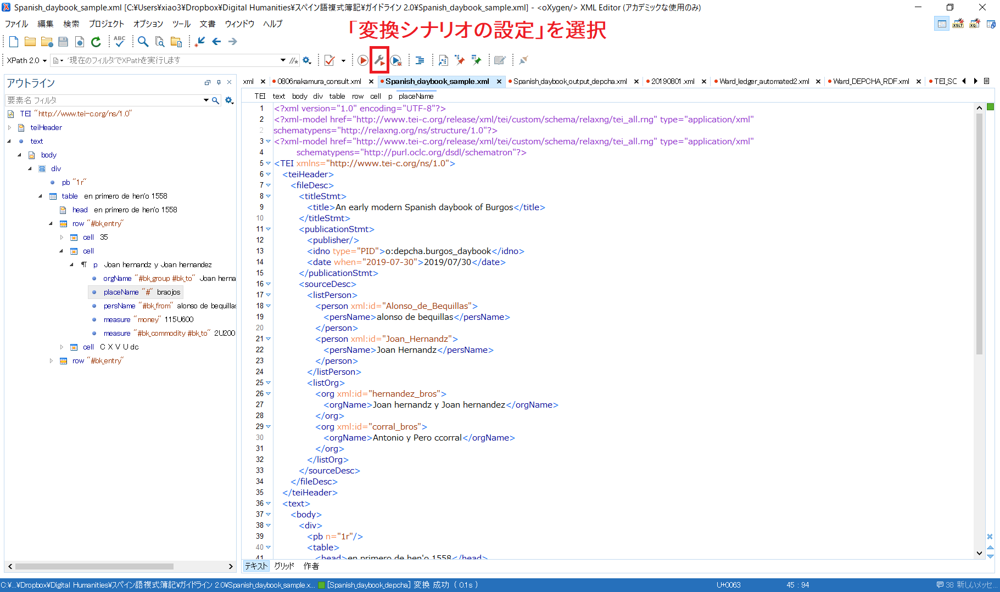

2. 次に、ポップアップウィンドウ内の「新規」→「XML transformation with XSLT」の順にクリックする

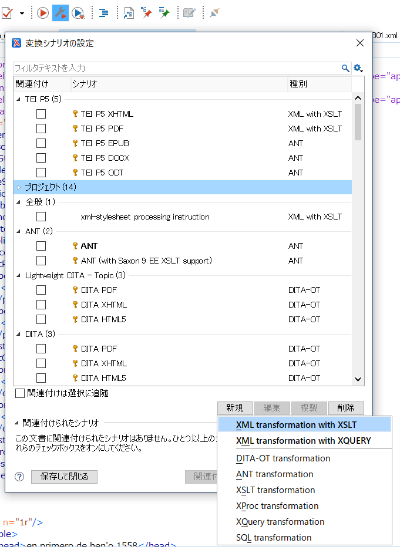

3. 「新しいシナリオ」ウィンドウの「XSLT」タブ内にある「XSL URL」を指定するにあたって、「ローカルファイルの参照」を選択し、保存しておいたDEPCHAによるXSLTファイルを選択する

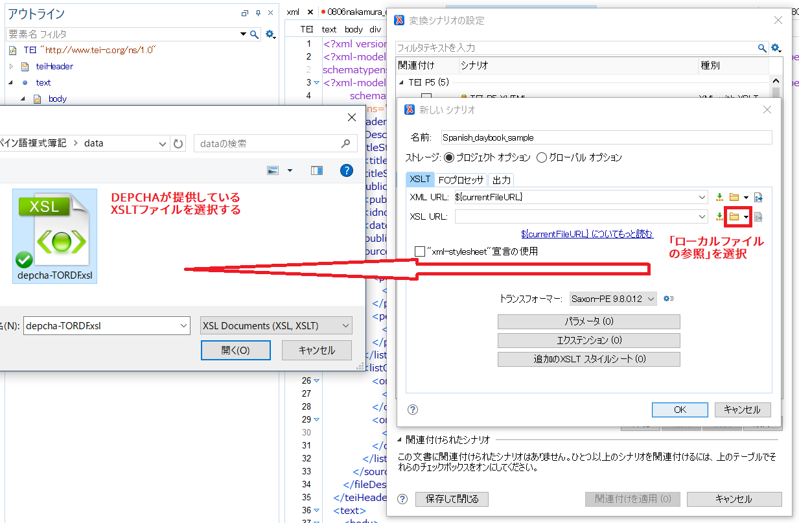

4. 次に「出力」タブに移動し、「別名で保存」バーにファイル名を入力する。.xmlの拡張子をつけ忘れないようにする

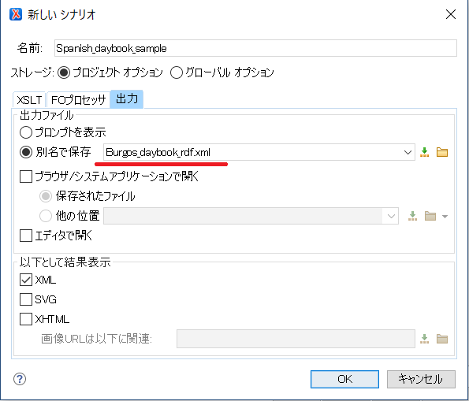

5. 最後に「関連付けを適用」ボタンをクリックすれば、変換が完了する

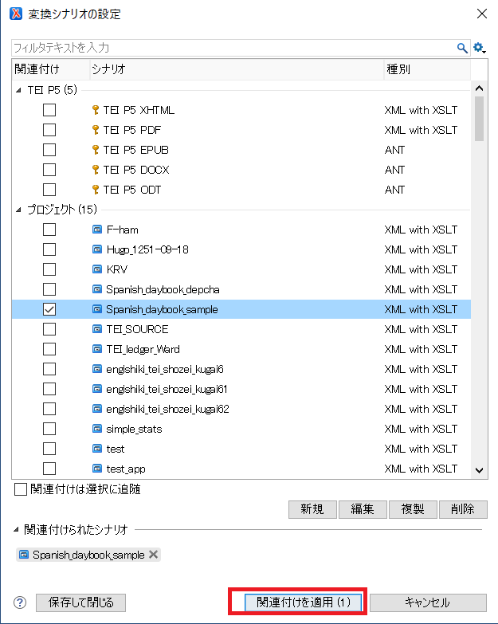

変換したRDFファイルは次のようになる。

```xml
<?xml version="1.0" encoding="UTF-8"?>
<rdf:RDF xmlns:rdf="http://www.w3.org/1999/02/22-rdf-syntax-ns#"
                           xmlns:rdfs="http://www.w3.org/2000/01/rdf-schema#"
                           xmlns:dc="http://purl.org/dc/elements/1.1/"
                           xmlns:functx="http://www.functx.com"
                           xmlns:gn="http://www.geonames.org/ontology#"
                           xmlns:gams="https://gams.uni-graz.at/o:gams-ontology/#"
                           xmlns:bk="https://gams.uni-graz.at/o:depcha.bookkeeping#"
                           xmlns:skos="http://gams.uni-graz.at/skos/scheme/o:oth/#"
                           xmlns:t="http://www.tei-c.org/ns/1.0"><bk:Transaction
                                                  rdf:about="https://gams.uni-graz.at/o:depcha.burgos_daybook#Transaction-0"
                                                  ><bk:consistsOf
                                                  rdf:resource="https://gams.uni-graz.at/o:depcha.burgos_daybook#Transaction-0-Transfer-1"
                                                  /><bk:consistsOf
                                                  rdf:resource="https://gams.uni-graz.at/o:depcha.burgos_daybook#Transaction-0-Transfer-2"
                                                  /><bk:entry>35 22 Joan hernandz y Joan hernandez
                                                  vez’os de braojos deuen por alonso de bequillas
                                                  115U600 que les dio p’a señal y pte de pago de
                                                  2U200 lanas q les conpro las 1U della 50 mas a
                                                  m’os de las caydas de lana pasado y las 1U100 para
                                                  este rreciuo primero a 80 mrs cada lana m’os 500
                                                  mrs en todo la paga al res’to sobre saca- C X V U
                                                  dc</bk:entry><gams:isPartofTEI
                                                  rdf:resource="https://gams.uni-graz.at/o:depcha.burgos_daybook"
                                                  /><gams:textualContent>35 22 Joan hernandz y Joan
                                                  hernandez vez’os de braojos deuen por alonso de
                                                  bequillas 115U600 que les dio p’a señal y pte de
                                                  pago de 2U200 lanas q les conpro las 1U della 50
                                                  mas a m’os de las caydas de lana pasado y las
                                                  1U100 para este rreciuo primero a 80 mrs cada lana
                                                  m’os 500 mrs en todo la paga al res’to sobre saca-
                                                  C X V U dc 2200 #lana lana 115600 #maravedís
                                                  alonso de bequillasJoan hernandz y Joan
                                                  hernandez</gams:textualContent></bk:Transaction><bk:Transfer
                                                  rdf:about="https://gams.uni-graz.at/o:depcha.burgos_daybook#Transaction-0-Transfer-1"
                                                  ><bk:transfers
                                                  rdf:resource="https://gams.uni-graz.at/o:depcha.burgos_daybook#Entry-0-Measurable-1"
                                                  /><bk:from
                                                  rdf:resource="https://gams.uni-graz.at/#hernandez_bros"
                                                  /><bk:to
                                                  rdf:resource="https://gams.uni-graz.at/#Alonso_de_Bequillas"
                                                  /></bk:Transfer><bk:Transfer
                                                  rdf:about="https://gams.uni-graz.at/o:depcha.burgos_daybook#Transaction-0-Transfer-2"
                                                  ><bk:transfers
                                                  rdf:resource="https://gams.uni-graz.at/o:depcha.burgos_daybook#Entry-0-Measurable-2"
                                                  /><bk:from
                                                  rdf:resource="https://gams.uni-graz.at/#Alonso_de_Bequillas"
                                                  /><bk:to
                                                  rdf:resource="https://gams.uni-graz.at/#hernandez_bros"
                                                  /></bk:Transfer><bk:Commodity
                                                  rdf:about="https://gams.uni-graz.at/o:depcha.burgos_daybook#Entry-0-Measurable-1"
                                                  ><bk:unit>#lana</bk:unit><bk:quantity>2200</bk:quantity><bk:commodity>lana</bk:commodity><rdfs:seeAlso
                                                  rdf:resource="https://dbpedia.org/resource/Lana"
                                                  /><bk:text>2U200
                                                  lanas</bk:text></bk:Commodity><bk:Money
                                                  rdf:about="https://gams.uni-graz.at/o:depcha.burgos_daybook#Entry-0-Measurable-2"
                                                  ><bk:unit>#maravedís</bk:unit><bk:quantity>115600</bk:quantity><bk:text>C
                                                  X V U dc</bk:text></bk:Money><bk:Transaction
                                                  rdf:about="https://gams.uni-graz.at/o:depcha.burgos_daybook#Transaction-1"
                                                  ><bk:consistsOf
                                                  rdf:resource="https://gams.uni-graz.at/o:depcha.burgos_daybook#Transaction-1-Transfer-1"
                                                  /><bk:consistsOf
                                                  rdf:resource="https://gams.uni-graz.at/o:depcha.burgos_daybook#Transaction-1-Transfer-2"
                                                  /><bk:entry>35 22 Antonio y Pero ccorral hermanos
                                                  vez'os de braojos deben por el dicho 17 U que les
                                                  dio p'a en señal y pte de pago de 400 lanas q les
                                                  compro p'a el reciuo q biene a 78 1/2 a lana a
                                                  pagar el rrs'to sobre sacas xvij
                                                  U</bk:entry><gams:isPartofTEI
                                                  rdf:resource="https://gams.uni-graz.at/o:depcha.burgos_daybook"
                                                  /><gams:textualContent>35 22 Antonio y Pero
                                                  ccorral hermanos vez'os de braojos deben por el
                                                  dicho 17 U que les dio p'a en señal y pte de pago
                                                  de 400 lanas q les compro p'a el reciuo q biene a
                                                  78 1/2 a lana a pagar el rrs'to sobre sacas xvij U
                                                  400 #lana lana 17000 #maravedís elAntonio y Pero
                                                  ccorral</gams:textualContent></bk:Transaction><bk:Transfer
                                                  rdf:about="https://gams.uni-graz.at/o:depcha.burgos_daybook#Transaction-1-Transfer-1"
                                                  ><bk:transfers
                                                  rdf:resource="https://gams.uni-graz.at/o:depcha.burgos_daybook#Entry-1-Measurable-1"
                                                  /><bk:from
                                                  rdf:resource="https://gams.uni-graz.at/#corral_bros"
                                                  /><bk:to
                                                  rdf:resource="https://gams.uni-graz.at/#Alonso_de_Bequillas"
                                                  /></bk:Transfer><bk:Transfer
                                                  rdf:about="https://gams.uni-graz.at/o:depcha.burgos_daybook#Transaction-1-Transfer-2"
                                                  ><bk:transfers
                                                  rdf:resource="https://gams.uni-graz.at/o:depcha.burgos_daybook#Entry-1-Measurable-2"
                                                  /><bk:from
                                                  rdf:resource="https://gams.uni-graz.at/#Alonso_de_Bequillas"
                                                  /><bk:to
                                                  rdf:resource="https://gams.uni-graz.at/#corral_bros"
                                                  /></bk:Transfer><bk:Commodity
                                                  rdf:about="https://gams.uni-graz.at/o:depcha.burgos_daybook#Entry-1-Measurable-1"
                                                  ><bk:unit>#lana</bk:unit><bk:quantity>400</bk:quantity><bk:commodity>lana</bk:commodity><rdfs:seeAlso
                                                  rdf:resource="https://dbpedia.org/resource/Lana"
                                                  /><bk:text>400
                                                  lanas</bk:text></bk:Commodity><bk:Money
                                                  rdf:about="https://gams.uni-graz.at/o:depcha.burgos_daybook#Entry-1-Measurable-2"
                                                  ><bk:unit>#maravedís</bk:unit><bk:quantity>17000</bk:quantity><bk:text>xvij
                                                  U</bk:text></bk:Money><bk:Between
                                                  rdf:about="https://gams.uni-graz.at/#hernandez_bros"
                                                  ><bk:name>Joan hernandz y Joan
                                                  hernandez</bk:name></bk:Between><bk:Between
                                                  rdf:about="https://gams.uni-graz.at/#Alonso_de_Bequillas"
                                                  ><bk:name>alonso de
                                                  bequillas</bk:name></bk:Between><bk:Between
                                                  rdf:about="https://gams.uni-graz.at/#corral_bros"
                                                  ><bk:name>Antonio y Pero
                                                  ccorral</bk:name></bk:Between></rdf:RDF>
```

RDFグラフの構造を理解するには、やはりネットワーク構造が適しているので、神崎正英氏の開発した「RDFグラフの視覚化」ツール(https://www.kanzaki.com/works/2009/pub/graph-draw)を用いると、次のような結果を得る。

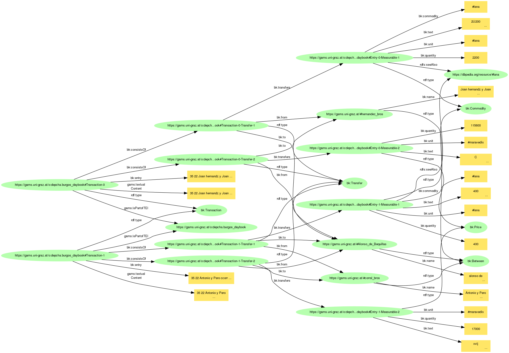

## **6-2. 標準化データ記述の価値**

さて、次にRDFグラフから分析に必要な情報を取り出すことを考えよう。RDFグラフは、それ自体でネットワーク構造を有しているデータベースだが、歴史研究の分析にそのまま用いることに最適化しているわけではないので、やはり研究目的に沿うようなデータを取り出せるようにしたいところである。「<span style="color:red">**いつ誰が誰との間で何を取引したのか、その代金はいくらで、どのような品物をどの程度手に入れたのか**</span>」といった取引情報さえ構造化されたデータ形式で取り出せれば、例えば人物間の商取引ネットワークを描いたり、ある特定の人物が営んでいたビジネスに関係するステークホルダーを取引規模の大小に応じて把握したりするような経済史的分析につなげることができるだろう。

ここで解消しておきたい疑問が一つある。それは、「わざわざRDFファイルを生成しなくても、マークアップしたTEI/XMLファイルからデータを抽出するか、元の紙媒体の史料から翻刻したデータをそのままエクセルシートで管理すれば済むのではないか」という疑問である。確かにこのような研究実践（特に後者）は、研究者個人の研究実践としてはごくありふれたものだと考えられるし、その上、二重三重にデータ構築のコストをかけてまで得られる見返りはあるのか、という問いは素朴ながら的を射ていて本質的である。なぜ的を射ているのかと言うと、この問いは「標準的な形式でデータを構築することのメリット」につながっているからである。

この問いに答えるために、我々が踏んできた手順をいま一度振り返ってみよう。

    1. 紙の原史料に記載されている内容を翻刻し、プレーンテキストデータとする
    2. プレーンテキストデータを、TEI/XML準拠でマークアップする
    3. マークアップファイルを基に、RDFファイルを生成する

1から2、そして2から3へのデータ化はともに、人文学の世界だけでなくウェブの世界に広がる「知のつながり」に向けて、歴史的商取引のデータを解き放つ価値を有している。まず、TEIマークアップは、テクストに見られる固有表現について可能な限り外部の学術ソースへのリンクを貼ることによって参照点（URI）を生成し、自らがマークアップしたテクストをセマンティックWEB技術によって解釈しやすいデータとして流通させることができ、結果としてウェブ上に広がる膨大な知のネットワークを豊かにすることができる、という性質を持つ ([Bizer, 2009](#bizer2009); [Hughes et al., 2016](#hughes2016), pp. 160-161; [Oldman et al., 2016](#oldman2016), p. 262)。すなわち、**TEIマークアップは、テクストの読解・解釈にあたって、外部の学術情報にアクセスしながら自分の理解を促進するという側面がある一方で、適切なタグ選定やリンク付けによって、ウェブの世界へ知を発信するという側面も兼ね備えているのである**。

しかしながら、TEIは個別の史料を対象にXML準拠で柔軟にマークアップするため、どうしても史料ごとの多様性に影響され、マークアップファイルを対象にデータを取り出したりするには、研究プロジェクトごとに処理プログラムを開発しなければならないという課題がある。この課題を解決すべくDEPCHAは、取引情報だけを取り出してRDFグラフに変換するための語彙セットとアルゴリズムを開発したのである。たしかに、彼らのアルゴリズムによって変換したRDFファイルには、TEIファイルの中で記述されていたはずの書誌情報や異なる校訂版の間で見られるテクストの異同、紙媒体の史料におけるレイアウト情報といったデータは抜け落ちている。**しかしDEPCHAは、取引情報だけをRDFグラフの形式で取り出せるようにしたことによって、時代・地域・分野を問わず、どのようなTEIマークアップファイルを対象にしたとしても、取引情報が記されていさえすれば、共通の処理プログラムを適用できるようにしたのである。つまり、DEPCHAは、TEIの課題の一つとして挙げた「汎用性の高い処理プログラム開発の困難さ」への解決策を、経済史的文脈において提示しているのである**。


## **6-3. SPARQL**

RDFからデータを取り出すための現在のウェブ標準としてW3Cが推奨しているのはSPARQLというクエリ言語である。その文法などの詳しい説明については、\[[加藤ほか, 2015](#kato2015)\] など関連文献に譲るとして、ここでは上記RDFファイルからデータを取得するために、ローカルファイルに対してSPARQLクエリをかけられるプログラミング言語Pythonのrdflibモジュールを用いて、データ取得のコードを記す。次の情報を出力するようにした。

- 取引ID
- 取引を構成する転位のID
- 誰から
- 誰へ
- 何を
- どれだけ
- どの単位で


```py
from rdflib import Graph
from rdflib import Namespace
from rdflib import URIRef, Literal

g = Graph()
g.parse('Burgos_daybook_rdf.xml')

qres = g.query("""
    PREFIX bk: <https://gams.uni-graz.at/o:depcha.bookkeeping#>
    PREFIX rdf: <http://www.w3.org/1999/02/22-rdf-syntax-ns#>
    
    SELECT ?transaction ?transfer ?from ?to ?commodity ?quantity ?unit
    WHERE {
        ?transaction rdf:type bk:Transaction;
                     bk:consistsOf ?transfer.

        ?transfer bk:from ?from.
        ?transfer bk:to ?to.
        ?transfer bk:transfers ?measure.

    OPTIONAL{?measure bk:commodity ?commodity}.
    OPTIONAL{?measure bk:quantity ?quantity}.
    OPTIONAL{?measure bk:unit ?unit}.
    }""")


for row in qres:
    for match in row:
        if match != None:
            print(match, end='')
        else:
            print('', end='')
        print('\\t', end='')
```

出力結果は次のようになる。

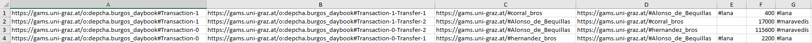

ただし、現状、金額を示すURIを生成できずにいる。今後、要検討。

---
7. # <a id="viz">Visualization</a>

ここでは、データ可視化の例をいくつか示したい。

まず、取引関係だけに着目した人物・グループ間の相関図をGephiを用いてネットワークとして描画してみる。上記SPARQLクエリにおける?fromと?toのデータを若干修正した上で表形式のテクストファイルに出力するPython関数を、次のように定義した。

```py
from rdflib import Graph
from rdflib import Namespace
from rdflib import URIRef, Literal

def convert_DEPCHA_rdf_to_simple_network(parse_file, output_file):
    g = Graph()
    g.parse(parse_file)
    
    qres = g.query("""
        PREFIX bk: <https://gams.uni-graz.at/o:depcha.bookkeeping#>
        PREFIX rdf: <http://www.w3.org/1999/02/22-rdf-syntax-ns#>
    
        SELECT distinct ?from ?to ?commodity ?quantity ?unit
        WHERE {
            ?transfer bk:from ?from.
            ?transfer bk:to ?to.
        }""")
    
    f_output = open(output_file, 'w', encoding='utf-8')
    f_output.write('Source\tTarget\tLabel\t')
    f_output.write('\n')
    
    tab = '\t'
    
    for row in qres:
        source = row[0].split('#')[-1]
        target = row[1].split('#')[-1]
        
        # Extracting the endpoint from the resource URI to render it as the label
        label = row[1].split('#')[-1]
        f_output.write(f'{source}{tab}{target}{tab}{label}{tab}')
        f_output.write('\n')
        
    f_output.close()
    
    return None

convert_DEPCHA_rdf_to_simple_network('Spanish_daybook_output_depcha.xml', 'Spanish_daybook_simple_graph.tsv')
```

これにより、ネットワーク分析ソフトウェアのひとつGephiを用いて、（非常に単純であるが）次のようなネットワーク図を描画できるようになった。ちなみに各ノードの大きさは、取引にかかわった回数に応じて決定している。いわゆる次数中心性に基づく分析である。

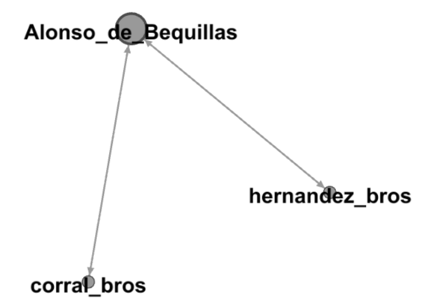

---
# <a id="section2">Section 2: 元帳</a>

1. # <a id="markup-example">元帳のマークアップ</a>

- 元帳の性質とリサーチクエスチョン

伏見「ガルシア＆ミゲル・デ・サラマンカ商会の元帳」6頁、によれば、元帳のマークアップによって考察したい研究上の問いは、次の文に現れているように思われる。

    …元帳では、見開きページのなかの、左側のx個のエントリーと、右側のy個のエントリーを、ひとつのまとまり、すなわち1単位として扱う必要がある。これを仮に元帳の「基本単位（会計学的な用語はないか？）」と呼ぶ。

ここで興味深いのは、左右それぞれのページを横断するように取引の対応関係が表示されていることから、見開きページをひとつのまとまった空間として捉える必要があるということである。したがって、ページの区切りよりは、あくまで仕訳の対応関係が重要ということであるから、何をひとまとまりのテクスト群として設計するかを考えなければならない。

もう一点注意しておきたいのは、同資料4頁で記されている次の指摘である。

      注意事項（1）：見開き2ページに、複数のデータセットが並存することがある
      ここまでの説明では、見開きの左右2ページに記載されたデータが、1セット、としていた。しかし、1ページ全体を埋めるほどのデータ数がない場合、たとえば左右1件ずつしかない場合、ページにはたくさんの余白ができてしまう。そのため、実際の元帳では、見開き2ページに、複数のデータセットが記入されることがある。

つまり、見開きページの左右を横断するまとまり（「基本単位」。仕訳（Entry）、と考えて良いのではないだろうか）が複数存在し、そのまとまりの中で貸借の収支が釣り合っているということである。ただし、ここで考えられるのは、紙幅の都合などで、ページをまたいでひとつの仕訳が記入されている場合があるのではないか、ということである。こうなると、ページの区切りは形骸化し、あくまで日記帳からの参照点としてのみ機能することになる。本質的に重要なのは、仕訳をひとつのまとまりとして捉えることだろう。

ここでDEPCHAの（現状の）限界が見えてくる。DEPCHAは、ひとつの取引をbk:Transactionクラスのオブジェクトとして記述することができるが、それらを仕訳された取引群としてRDF化することはできないように思われる。

したがって、今回の元帳マークアップでは、DEPCHAの推奨する方式はひとまず取りおいて、貸借の対応関係を示せるような方法を試案することとする。

全体のマークアップ構造として、次のようにした。


- ひとつのページに複数の仕訳が含まれている場合があることから、@ana属性値entryを持つdivタグの親要素として、見開きページ番号を含む@xml:id属性を持つdivタグを設定した
- @ana属性値としてentry, debit, creditを設定することによって、仕訳のまとまり、それに属する貸方と借方の階層構造を表現した
- tableタグの中に、複数のrow（行を意味する）タグが含まれており、@n属性によって、取引の序数が示されている（何番目の取引か、という情報）
- rowタグの中には、cellタグが2つ含まれており、それぞれ摘要（@ana="desc"）と金額（@ana="amount"）を示す
- 摘要の中では、人名や品目名、貸方もしくは借方の参照ページ数などをタグ付けすることができる


実際のマークアップファイルは以下のようになる。

```xml
<?xml version="1.0" encoding="UTF-8"?>
<?xml-model href="http://www.tei-c.org/release/xml/tei/custom/schema/relaxng/tei_all.rng" type="application/xml" schematypens="http://relaxng.org/ns/structure/1.0"?>
<?xml-model href="http://www.tei-c.org/release/xml/tei/custom/schema/relaxng/tei_all.rng" type="application/xml"
	schematypens="http://purl.oclc.org/dsdl/schematron"?>
<TEI xmlns="http://www.tei-c.org/ns/1.0">
   <teiHeader>
      <fileDesc>
         <titleStmt>
            <title>ブルゴス元帳マークアップ試案</title>
         </titleStmt>
         <publicationStmt>
            <p>Publication Information</p>
         </publicationStmt>
         <sourceDesc>
            <p>Information about the source</p>
         </sourceDesc>
      </fileDesc>
   </teiHeader>
   <text>
      <body>
         <div xml:id="ledger_22">
            <fw>22</fw>
            <head>+<date when="1558">1558</date>+</head>
            <div ana="entry" n="1">
               <div ana="debit">
                  <table>
                     <row n="1">
                        <cell ana="desc">+Alonso de beguillas deue En pro de Henero 170 U que so^
                           Por el rrsto de/otra su quenta del libro viejo de los negos De rroan de
                           compa que son por 5 U rres que le dio migl de sa para Lleuar a la sierra
                           de Pedraza como pez en el dho libro a fo |_<ref>320</ref>
                        </cell>
                        <cell ana="amount">c lxx U -</cell>
                     </row>
                     <row n="2">
                        <cell ana="desc">+ en este dia 170 U que son por 5 U rres que por cedula de
                           garcia De salamanca le dio Gregorio de santa maria pez |_<ref>29</ref>
                        </cell>
                        <cell ana="amount">c lxx U -</cell>
                     </row>
                     <row n="3">
                        <cell ana="desc">+ en este dia 170 U que son por 5 U rres los 4 U que sobro
                           de po Lopez canuio por ca de miguel de sa e los 1 U rres que le dio el
                           dho miguel para lleuar a la dha sierra como pez |_<ref>17</ref>
                        </cell>
                        <cell ana="amount">c lxx U -</cell>
                     </row>
                     <row n="4">
                        <cell ana="desc">+ en este dia 646 U que son por 19 U rreales que le dio el
                           dho miguel de sa la segunda bez que fue a la dha sierra |_<ref>27</ref>
                        </cell>
                        <cell ana="amount">dc xl vj U -</cell>
                     </row>
                     <row n="5">
                        <cell ana="desc">+ en este dia 102 U que son por 3 U rreales que les dio el
                           dho miguel de salamanca la tercera bez q boluio a dha sa |_<ref>27</ref>
                        </cell>
                        <cell ana="amount">c ij U -</cell>
                     </row>
                     <row n="6">
                        <cell/>
                        <cell ana="sum">i qo cc l viij U -</cell>
                     </row>
                  </table>
               </div>
               <div ana="credit">
                  <table>
                     <row n="1">
                        <cell ana="desc">+ A de auer En pro de Heno 37 U 500 que son por tantos dio
                           de contado a frutos Lopez y mari Lopez su madre |_<ref>20</ref></cell>
                        <cell ana="amount">xxx vij U d-</cell>
                     </row>
                     <row n="2">
                        <cell ana="desc">+ en este dia 74 U 800 que dio de qo a antonio cerezo
                              |_<ref>34</ref></cell>
                        <cell ana="amount">lxx iiij U dccc</cell>
                     </row>
                     <row n="3">
                        <cell ana="desc">+ en este dia 71 U 400 que dio a go lopez de Lozoya pze
                              |_<ref>34</ref></cell>
                        <cell ana="amount">lxx j U dccc</cell>
                     </row>
                     <row n="4">
                        <cell ana="desc">+ en este dia 17 U 408 que dio a Joan de pero sainz pze
                              |_<ref>34</ref></cell>
                        <cell ana="amount">x vij U cccc viij</cell>
                     </row>
                     <row n="5">
                        <cell ana="desc">+ en este dia 4 U 488 que dio a lucas lopez de penilla
                              |_<ref>34</ref></cell>
                        <cell ana="amount">iiij U cccc lxxx viij</cell>
                     </row>
                     <row n="6">
                        <cell ana="desc">+ en este dia 1 U 700 que dio a Joan dezcaray de Lozoya
                              |_<ref>35</ref></cell>
                        <cell ana="amount">j U dcc</cell>
                     </row>
                     <row n="7">
                        <cell ana="desc">+ en este dia 105 U 400 que dio a franco y andres hrres
                              |_<ref>35</ref></cell>
                        <cell ana="amount">c v U cccc</cell>
                     </row>
                     <row n="8">
                        <cell ana="desc">+ en este dia 115 U 600 que dio a Joan hernandez
                              |_<ref>35</ref></cell>
                        <cell ana="amount">c x v U dc</cell>
                     </row>
                     <row n="9">
                        <cell ana="desc">+ en este dia 17 U que pago a antonio po corral pze
                              |_<ref>35</ref></cell>
                        <cell ana="amount">x vij U -</cell>
                     </row>
                     <row n="10">
                        <cell ana="desc">+ en este dia 10 U 200 que pago a bartolome belazquez pze
                              |_<ref>36</ref></cell>
                        <cell ana="amount">x U cc</cell>
                     </row>
                     <row n="11">
                        <cell ana="desc">+ en este dia 10 U 200 que pago a andres martin pze
                              |_<ref>36</ref></cell>
                        <cell ana="amount">x U cc</cell>
                     </row>
                     <row n="12">
                        <cell ana="desc">+ en este dia 2 U 040 que pago a min de carnezia
                              |_<ref>36</ref></cell>
                        <cell ana="amount">ij U xl</cell>
                     </row>
                     <row n="13">
                        <cell ana="desc">+ en este dia 8 U 500 que pago a Jno hrres y as perez pze
                              |_<ref>36</ref></cell>
                        <cell ana="amount">v iij U d -</cell>
                     </row>
                     <row n="14">
                        <cell ana="desc">+ en este dia 10 U 200 que pago a Joan del pozo pze
                              |_<ref>37</ref></cell>
                        <cell ana="amount">x U cc -</cell>
                     </row>
                     <row n="15">
                        <cell ana="desc">+ en este dia 5 U 100 que pago a Jnoan min de Lozoya
                              |_<ref>37</ref></cell>
                        <cell ana="amount">v U c -</cell>
                     </row>
                     <row n="16">
                        <cell ana="desc">+ en este dia 408 que pago a Benito hernandez pze
                              |_<ref>37</ref></cell>
                        <cell ana="amount"> U cccc viij</cell>
                     </row>
                     <row n="17">
                        <cell ana="desc">+ en este dia 81 U que pago a pasqual sanchez pze
                              |_<ref>37</ref></cell>
                        <cell ana="amount">lxxx j U -</cell>
                     </row>
                     <row n="18">
                        <cell ana="desc">+ en este dia 22 U 100 que pago a po min de sancho po
                              |_<ref>38</ref></cell>
                        <cell ana="amount">xx U c -</cell>
                     </row>
                     <row n="19">
                        <cell ana="desc">+ en este dia 34 U que pago a marcos hernandez
                              |_<ref>38</ref></cell>
                        <cell ana="amount">xxx iiij U -</cell>
                     </row>
                     <row n="20">
                        <cell ana="desc">+ en este dia 7 U que pago a andres Sainz de Villorejo
                              |_<ref>38</ref></cell>
                        <cell ana="amount">vij U -</cell>
                     </row>
                     <row n="21">
                        <cell ana="desc"> // // //</cell>
                        <cell ana="sum_temporal">dc xxx vj U- xl iiij</cell>
                     </row>
                     <row n="22">
                        <cell ana="desc">+ en este dia 1 U 734 que pago a Joan Sainz el biejo
                              |_<ref>38</ref></cell>
                        <cell ana="amount">j U dcc xxx iiij</cell>
                     </row>
                     <row n="23">
                        <cell ana="desc">+ en este dia 2 U 992 que pago a Jno gamo y po braojos
                              |_<ref>39</ref></cell>
                        <cell ana="amount">ij U dcccc xc ij</cell>
                     </row>
                     <row n="24">
                        <cell ana="desc">+ en este dia 12 U 920 que pago a anton martin pze
                              |_<ref>39</ref></cell>
                        <cell ana="amount">xij U dcccc xx</cell>
                     </row>
                     <row n="25">
                        <cell ana="desc">+ en este dia 12 U 170 que pago a Joan Sainz scriuano
                              |_<ref>39</ref></cell>
                        <cell ana="amount">xij U c lxx</cell>
                     </row>
                     <row n="26">
                        <cell ana="desc">+ en este dia 45 U que pago a migel y Joan sanchez
                              |_<ref>39</ref></cell>
                        <cell ana="amount">xl v U -</cell>
                     </row>
                     <row n="27">
                        <cell ana="desc">+ en este dia 40 U que pago a andres martin paze
                              |_<ref>40</ref></cell>
                        <cell ana="amount">xl U -</cell>
                     </row>
                     <row n="28">
                        <cell ana="desc">+ en este dia 23 U 800 que pago a Joan perez de pradano
                              |_<ref>40</ref></cell>
                        <cell ana="amount">xx iij U dccc-</cell>
                     </row>
                     <row n="29">
                        <cell ana="desc">+ en este dia 17 U que pago a Joan Sanchez de pena
                              |_<ref>40</ref></cell>
                        <cell ana="amount">x vij U </cell>
                     </row>
                     <row n="30">
                        <cell ana="desc">+ en este dia 6 U 800 que pago a frutos caluo pze
                              |_<ref>40</ref></cell>
                        <cell ana="amount">vj U dccc</cell>
                     </row>
                     <row n="31">
                        <cell ana="desc">+ en este dia 119 U que pago a anton ges guillen paze
                              |_<ref>41</ref></cell>
                        <cell ana="amount">cx ix U -</cell>
                     </row>
                     <row n="32">
                        <cell ana="desc">+ en este dia 34 U que pago a A franco min de luzia
                              |_<ref>41</ref></cell>
                        <cell ana="amount">xxx iiij U</cell>
                     </row>
                     <row n="33">
                        <cell ana="desc">+ en este dia 20 U 400 que pago a Joan gonzalez paze
                              |_<ref>41</ref></cell>
                        <cell ana="amount">xx U cccc</cell>
                     </row>
                     <row n="34">
                        <cell ana="desc">+ en este dia 54 U 400 que pago a pero blazquez paze
                              |_<ref>41</ref></cell>
                        <cell ana="amount">l iiij U cccc</cell>
                     </row>
                     <row n="35">
                        <cell ana="desc">+ en este dia 10 U 200 que pago a alo min de arriua
                              |_<ref>42</ref></cell>
                        <cell ana="amount">x U cc</cell>
                     </row>
                     <row n="36">
                        <cell ana="desc">+ en este dia 85 U que pago a marcos hernandez paze
                              |_<ref>42</ref></cell>
                        <cell ana="amount">lxxx v U -</cell>
                     </row>
                     <row n="37">
                        <cell ana="desc">+ en este dia 10 U 200 que pago a anton de la mata e conpa
                              |_<ref>42</ref></cell>
                        <cell ana="amount">x U cc</cell>
                     </row>
                     <row n="38">
                        <cell ana="desc">+ en este dia 10 U 200 que pago a Joan de herrera paze
                              |_<ref>42</ref></cell>
                        <cell ana="amount">x U cc</cell>
                     </row>
                     <row n="39">
                        <cell ana="desc">+ en este dia 68 U que pago al comendador y freires
                              |_<ref>43</ref></cell>
                        <cell ana="amount">lx viij U</cell>
                     </row>
                     <row n="40">
                        <cell ana="desc">+ en este dia 22 U 199 que dio por qa aber echo de costas
                           en la dha sierra en la conpra de la lana como paze |_<ref>44</ref></cell>
                        <cell ana="amount">xx U c xc ix</cell>
                     </row>
                     <row n="41">
                        <cell ana="desc">+ en este dia 25 U 941 q^ dio de qo a migel de sa pa fin de
                           su qa |_<ref>27</ref></cell>
                        <cell ana="amount">xx v U dcccc xl j</cell>
                     </row>
                     <row n="42">
                        <cell/>
                        <cell ana="sum">j qo cc l viij U</cell>
                     </row>
                  </table>
               </div>
            </div>
         </div>
         <div xml:id="ledger_35">
            <fw>35</fw>
            <head>+<date when="1558">1558</date>+</head>
            <div ana="entry" n="1">
               <div ana="debit">
                  <table>
                     <row n="1">
                        <cell ana="desc">+ Jhoan Dezcaray vzo de lozoya deue En pro de Heno 1 U 700
                           que le dio ao de bequillas para señal y pte de pago de 50 lanas q^ le
                           compro a 68 cada lana a pagar el rrsto al rreciuo |_22</cell>
                        <cell ana="amount">jUdcc</cell>
                     </row>
                     <row n="2">
                        <cell ana="desc">+ en 9 de junio 1700 q^ le dio po de cauallos pa fin desta
                           qa |_31</cell>
                        <cell ana="amount">jUdcc</cell>
                     </row>
                     <row n="3">
                        <cell/>
                        <cell ana="sum">iijUiiij</cell>
                     </row>
                  </table>
               </div>
               <div ana="credit">
                  <table>
                     <row n="1">
                        <cell ana="desc">+ A de auer En 9 de junio 3 U 400 que son por 50 las q^ Dio
                           este rreciuo a 68 lana q es lo dicho pez |_33</cell>
                        <cell ana="amount sum">iij U cccc</cell>
                     </row>
                  </table>
               </div>
            </div>
            <div ana="entry" n="2">
               <div ana="debit">
                  <table>
                     <row n="1">
                        <cell ana="desc">+ franco y andres Hrres Vzos de braojos deuen En pro de
                           Heno 105 U 400 que le dio ao de beguillas para señal y parte de Pago de 1
                           U 500 lanas que le conpro las 1 U 400 estreme Nas a 83 y 100 lanas
                           churras a 73 rrsto sobre saca |_22</cell>
                        <cell ana="amount">C – V U CCCC</cell>
                     </row>
                  </table>
               </div>
               <div ana="credit">
                  <table>
                     <row n="1">
                        <cell ana="desc">+ An de auer En 9 de junio 100 U 386 que son por 1 U 118
                           les estremenas a 83 que son 92 U 794 y 104 lanas churras a 73 que son 7 U
                           592 que dio este rreciuo que es lo dho |_33</cell>
                        <cell ana="amount">c U ccc lxxx vj</cell>
                     </row>
                     <row n="2">
                        <cell ana="desc">+ en 8 de nouie 5 U 014 que dio de contado a po de
                           cauallos</cell>
                        <cell ana="amount">vU x iiij</cell>
                     </row>
                     <row n="3">
                        <cell/>
                        <cell ana="sum">c v U cccc</cell>
                     </row>
                  </table>
               </div>
            </div>
            <div ana="entry" n="3">
               <div ana="debit">
                  <table>
                     <row n="1">
                        <cell ana="desc">+ Jhoan y po hrres Vzos de braojos deuen en pro de heno 115
                           U 600 que les dio ao de beguillas pa señal y pre de pago de 2 U 200 ls
                           que les conpro las 1 U dellas 50 mas a mos de las caidas el ano pasdo y 1
                           U 100 de ogano a 80 mrs cada lana mos 500 mrs En todo a pagar el rresto
                           sobresaca como pez |_22</cell>
                        <cell ana="amount">CX V U dc</cell>
                     </row>
                     <row n="2">
                        <cell ana="desc">+ en 9 de junio 56 U 540 q^ le dio cauallos pa fin desta qa
                           |_31</cell>
                        <cell ana="amount">L vi U de xl</cell>
                     </row>
                     <row n="3">
                        <cell/>
                        <cell ana="sum">c Lxx ij U c xL</cell>
                     </row>
                  </table>
               </div>
               <div ana="credit">
                  <table>
                     <row n="1">
                        <cell ana="desc">+ An de auer En 9 de junio 172 U 140 que son por 2 U 158
                           lanas q^ dieron este rreciuo a 80 mrs cada lana con 500 mrs que se le
                           rrebaten es lo dicho como paresce |_33</cell>
                        <cell ana="amount sum">c lxx ij U c xL</cell>
                     </row>
                  </table>
               </div>
            </div>
            <div ana="entry" n="4">
               <div ana="debit">
                  <table>
                     <row n="1">
                        <cell ana="desc">+ Antonio y po corral vzso de braojos deuen En pro de Heno
                           17 U q les dio ao de beguillas pa senal y pte de pago de 400 las De los
                           conpro a 78 1/2 la lana a pagar el rrsto sobre saca |_22</cell>
                        <cell ana="amount">x vij U –</cell>
                     </row>
                     <row n="2">
                        <cell ana="desc">+ en 9 de junio 14 U 714 que le dio cauallos pa fin desta
                           qa |_31</cell>
                        <cell ana="amount">x iiij U dcc x iiij</cell>
                     </row>
                     <row n="3">
                        <cell/>
                        <cell ana="sum">xxx i U dcc x iiij</cell>
                     </row>
                  </table>
               </div>
               <div ana="credit">
                  <table>
                     <row n="1">
                        <cell ana="desc">+ An de auer En 9 de junio 31 U 714 que son por 404 lanas q
                           dieron este rreciuo a 78 1/2 cada lana que es lo dho |_33</cell>
                        <cell ana="amount sum">xxx j U dcc x iiij</cell>
                     </row>
                  </table>
               </div>
            </div>
         </div>
      </body>
   </text>
</TEI>
```

---
2. # <a id="linking">Linking</a>

本セクションで考察したいのは、日記帳と元帳の関係である。

      もともとのアイディアのひとつは、元帳をマークアップすることで、日記帳のエントリーがどのように分類されているか、この分類操作の手続きを理解することであった。しかし、このマークアップでは、日記帳と元帳の関係については、言及されない。
      この点をどう解決するかが、課題として残っている。

と伏見資料の末尾にもある。いくつかの観点から考えてみよう。

- ページの対応

日記帳に記された取引は、元帳の借方と貸方のページに転記されることから、それぞれの参照ページ数が書かれている。次のような具合である。

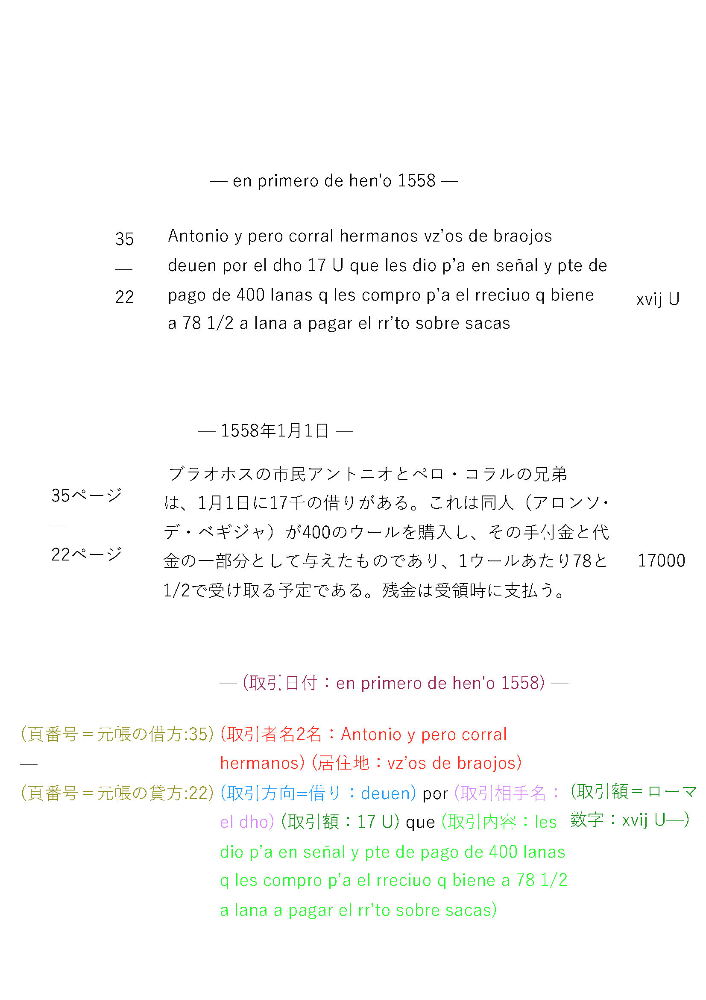

したがって、ひとまずここに記されている35（ページ）と22（ページ）という数字から、元帳にリンクを飛ばすような設計にする必要があるだろう。しかし、元帳から日記帳をたどることは構造的に不可能であることは付記しておきたい。35ページと22ページはどちらも元帳のページ数であり、それら元帳のページを見てみても日記帳のページ数は記されていないからである。

つまり、リンクを飛ばすのは日記帳から元帳に向かってのみ、ということになるので、次のようにマークアップしてみた。

```xml
<head>en primero de hen'o <date>1558</date></head>
<row ana="bk:entry" n='1' corresp='burgos_ledger.xml#ledger_35/div[@ana="entry"][3]/div[@ana="debit"]/table/row[1] burgos_ledger.xml#ledger_22/div[@ana="entry"][1]/div[@ana="credit"]/table/row[8]'>
   <cell><ref>35</ref><lb/><ref>22</ref></cell>
   <cell><p><orgName ana="bk:group bk:to" ref="#hernandez_bros">Joan hernandz y Joan hernandez</orgName> vez’os de <placeName ref="#">braojos</placeName> deuen por <persName ana="bk:from" ref="#Alonso_de_Bequillas">alonso de bequillas</persName> 115U600 que les dio p’a señal y pte de pago de <measure ana="bk:commodity bk:to" commodity="lana" quantity="2200" unit="#lana">2U200 <rs ref="#P01_lana">lanas</rs></measure> q les conpro las 1U della 50 mas a m’os de las caydas de lana pasado y las 1U100 para este rreciuo primero a 80 mrs cada lana m’os 500 mrs en todo la paga al res’to sobre saca-</p></cell>      <cell><measure ana="bk:money bk:from" commodity="currency" quantity="115600" unit="#maravedís">C X V U dc</measure></cell>
</row>
```

ここで注目したいのは、@ana="bk:entry"の属性値を持っているrowタグの@corresp属性の値である。この取引は、元帳借方の35ページ、元帳貸方の22ページに転記されていることから、機械的なデータ抽出のしやすさを考慮して、ひとつの@corresp属性から参照を飛ばせるようにした。

参照方法は少し複雑に見えるが、XPATH構文を用いており、「同じディレクトリに存在する元帳のマークアップファイルの中の、（見開き）ページ数および借方・貸方の別、そして何番目の取引か」ということを示している。

---
3. # <a id="xbrl">XBRLの検討</a>

\[[Anderson, 2016](#anderson2016)\] は、場合によってはTEIは財務記録史料構造化のための最適な手法ではないと考えている。

    TEI may not be the best way to represent aggregated financial data, especially if a goal is to process that data with contemporary data analysis tools.

そもそも、DEPCHAのプロジェクト・マネージャーであるGeorg Vogelerは、DEPCHAの考案過程において、次のように述べている。

      While TEI has established itself as a common encoding semantics for texts in their linguistic and physical representation, XBRL is on the way to become a common reference for the description of economic facts. For the purpose of digital editing accounting texts in their multiplicity as visual, linguistic and economic objects the separation of technologies for textual and factual modelling and encoding remains.

要するに、TEIは言語表現や史資料の体裁情報をうまく構造化できることに強く、経済的な事実の表現にはXBRLが標準的に用いられているものの、それらを両立できるような枠組みが存在していない、としているのである \[[Vogeler, 2017](#vogeler2017), p. 6\] 。

したがって、ここまでTEIで検討してきたものの、もし研究上の課題が、複式簿記の体裁上の情報などを問題にしないのであれば、TEIにこだわる必要がない。XBRLの語彙を用いて、勘定科目や要素同士の関係性を表現すれば良い。ただ、このXBRLでの複式簿記表現については、今後の課題としたいところである。

---

8. # <a id="reference-lists">Reference Lists</a> (Harvard Citation Style)

      <a id="anderson2016">Anderson, C. (2016)</a> Exploring XBRL for Historic Financial Data, MEDEA Spring Meeting at Wheaton College, 2016, available from: https://medea.hypotheses.org/497 .

      <a id="bizer2009">Bizer, C. et al. (2009)</a> Linked Data: The Story So Far. *International Journal on Semantic Web and Information Systems*. 5 (3), 1–22. Available from: https://eprints.soton.ac.uk/271285/ (Accessed 5 January 2019).
      
      <a id="ciula2014">Ciula, A. & Eide, Ø. (2014)</a> ‘Reflections on Cultural Heritage and Digital Humanities: Modelling in Practice and Theory’, in *Proceedings of the First International Conference on Digital Access to Textual Cultural Heritage. DATeCH ’14*. [Online]. 2014 New York, NY, USA: ACM. pp. 35–41. [online]. Available from: http://doi.acm.org/10.1145/2595188.2595207 (Accessed 13 November 2018).<br>

      <a id="eide2014">Eide, Ø. (2014)</a> Ontologies, Data Modeling, and TEI. *Journal of the Text Encoding Initiative*. [Online] (Issue 8), . [online]. Available from: http://journals.openedition.org/jtei/1191 (Accessed 13 November 2018).<br>

      <a id="gams2017">GAMS (Geisteswissenschaftliches Asset Management System) (2017)</a> 'Bookkeeping Datamodel for Historical Accounts'. *DEPCHA - Digital Edition Publishing Cooperative for Historical Accounts* [online]. Available from: http://gams.uni-graz.at/archive/objects/o:depcha.bookkeeping/methods/sdef:Ontology/get (Accessed 1st December 2018).<br>

      <a id="hughes2016">Hughes, L. et al. (2016)</a> ‘Digital Methods in the Humanities: Understanding and Describing their Use across the Disciplines’, in Susan Schreibman et al. (eds.) *A New Companion to Digital Humanities*. 2nd Edition Chichester, West Sussex, UK: Wiley-Blackwell. pp. 150–170.

      <a id="laiacona2018">Laiacona, N., Brumfield, B., Kokaze, N., Nagasaki, K., and Goto, M. (2018)</a> Connecting IIIF and TEI. In: IIIF Consortium, *2018 IIIF Conference*. Washington DC 21-25 May2018. https://iiif.io/event/2018/washington/program/paper-61/<br>      
      
      <a id="oldman2016">Oldman, D. et al. (2016)</a> ‘Zen and the Art of Linked Data: New Strategies for a Semantic Web of Humanist Knowledge’, in Susan Schreibman et al. (eds.) *A New Companion to Digital Humanities*. 2nd Edition Chichester, West Sussex, UK: Wiley-Blackwell. pp. 251–273.

      <a id="renear2004">Renear, A. (2004)</a> ‘Text Encoding’, in Susan Schreibman et al. (eds.) *A Companion to digital humanities*. Chichester, West Sussex: John Wiley & Sons, Ltd. p. [online]. Available from: http://www.digitalhumanities.org/companion/view?docId=blackwell/9781405103213/9781405103213.xml&chunk.id=ss1-3-5&toc.depth=1&toc.id=ss1-3-5&brand=default (Accessed 29 September 2018).<br>

      <a id="">TEI Consortium, eds. (2018)</a> *TEI P5: Guidelines for Electronic Text Encoding and Interchange*. Version 3.4.0. Last updated on 23rd July 2018. TEI Consortium. http://www.tei-c.org/Guidelines/P5/ (Accessed 1st December 2018).<br>

      <a id="tomasek2013">Tomasek, K. & Bauman, S. (2013)</a> Encoding Financial Records for Historical Research. *Journal of the Text Encoding Initiative*. [Online] (Issue 6). Available from: http://journals.openedition.org/jtei/895 (Accessed 27 November 2018).

      <a id="tomasek2016">Tomasek, K. M. (2016)</a> Modeling semantically Enriched Digital Edition of Accounts (MEDEA). *hcommons*, [online]. Available from: https://hcommons.org/deposits/item/hc:12317/ (Accessed 13 November 2018).<br>

      <a id="vogeler2017">Vogeler, G. (2017)</a> The Content of Accounts and Registers in their Digital Edition. *hcommons*, [online]. Available from: https://hcommons.org/deposits/item/hc:13207/ (Accessed 13 November 2018).<br>

      <a id="kato2015">加藤文彦ほか (2015)</a> オープンデータ時代の標準Web API SPARQL. 東京:インプレスR&D.

      <a id="kokaze2019">小風尚樹・中村覚・永崎研宣 (2019)</a> 構造化記述された財務記録史料データの分析手法の開発：イギリスの船舶解体業を事例に, じんもんこん2019論文集.

